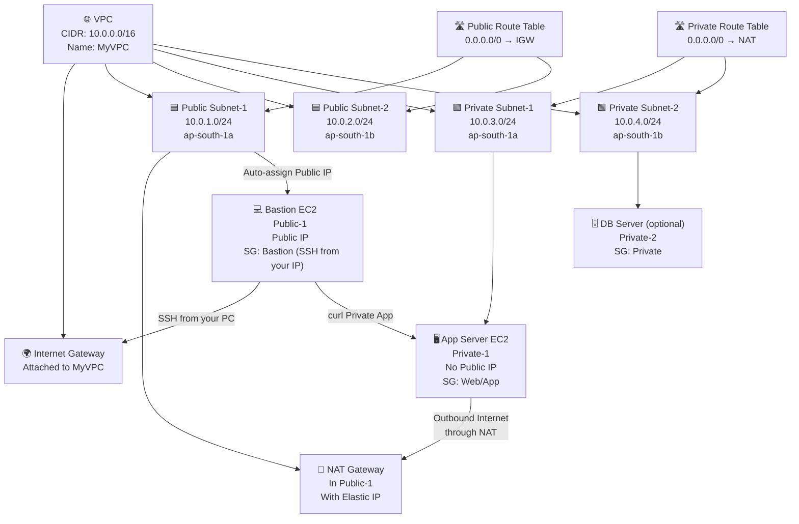
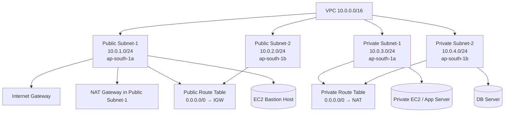

Here is a **clean, structured Mermaid flow diagram** for your **VPC + Subnets + Route Tables + NAT + EC2 topology** based exactly on your practical lab steps.

---

# **🔶 Mermaid Diagram — VPC Practical Topology**



---

# ✅ What This Diagram Shows

The diagram clearly shows:

### **✔ VPC structure**

– 4 subnets (2 public, 2 private)
– IGW, NAT Gateway

### **✔ Route table associations**

– Public RT → IGW
– Private RT → NAT

### **✔ EC2 placement**

– Bastion in Public-1
– App in Private-1
– DB in Private-2

### **✔ Traffic Flow**

– Your laptop → IGW → Bastion
– Private EC2 → NAT → Internet
– Bastion → Private EC2 (test using curl)

---
Below is your **complete detailed practical lab document** with **Mermaid diagram**, **step-by-step tasks**, **placeholder screenshot areas**, and **clean formatting** — perfect for training, assignments, or interview demos.

---

# 📘 **AWS VPC Hands-On Lab (FULL PRACTICAL GUIDE)**

### **VPC + Public/Private Subnets + IGW + NAT + Route Tables + EC2**

---

# 🖼️ **Mermaid Architecture Diagram**



---

# 📘 **Complete Step-by-Step Practical Guide**

---

# **Phase A: Create the VPC**

## ✅ **1. Create VPC**

**Console Path:**
**VPC → Create VPC → VPC Only**

| Setting   | Value         |
| --------- | ------------- |
| Name tag  | `MyVPC`       |
| IPv4 CIDR | `10.0.0.0/16` |

📸 **Screenshot Area:**
*(Add VPC creation screenshot here)*

---

# **Phase B: Create Subnets**

## ✅ **2. Create 4 Subnets**

### **Public Subnet 1**

* Name: **Public-1**
* IPV4: **10.0.1.0/24**
* AZ: **ap-south-1a**

### **Public Subnet 2**

* Name: **Public-2**
* IPV4: **10.0.2.0/24**
* AZ: **ap-south-1b**

### **Private Subnet 1**

* Name: **Private-1**
* IPV4: **10.0.3.0/24**
* AZ: **ap-south-1a**

### **Private Subnet 2**

* Name: **Private-2**
* IPV4: **10.0.4.0/24**
* AZ: **ap-south-1b**

📸 **Screenshot Area:**
*(Add subnet table screenshot here)*

---

# **Phase C: Create & Attach Internet Gateway**

## ✅ **3. Create IGW**

**VPC → Internet Gateways → Create IGW**

* Name: **MyVPC-IGW**
* Attach to **MyVPC**

📸 **Screenshot Area:**
*(Add IGW creation screenshot here)*

---

# **Phase D: Route Tables**

## ✅ **4. Public Route Table**

**VPC → Route Tables → Create New**

| Setting | Value       |
| ------- | ----------- |
| Name    | `Public-RT` |
| VPC     | `MyVPC`     |

### **Edit Routes**

| Destination | Target                      |
| ----------- | --------------------------- |
| 0.0.0.0/0   | Internet Gateway (igw-xxxx) |

### **Associate Subnets**

* **Public-1**
* **Public-2**

📸 **Screenshot Area:**
*(Add RT + route screenshot here)*

---

# **Phase E: Enable Auto-Assign Public IP**

**Subnets → Select Public-1 & Public-2 → Modify auto-assign IPv4 → ENABLE**

📸 **Screenshot Area:**
*(Add auto-assign screenshot here)*

---

# **Phase F: NAT Gateway**

## ✅ **5. Create NAT Gateway**

### Step 1 — Allocate Elastic IP

**Network & Security → Elastic IPs → Allocate**

### Step 2 — Create NAT

**VPC → NAT Gateways → Create NAT**

| Setting    | Value          |
| ---------- | -------------- |
| Subnet     | Public-1       |
| Elastic IP | Choose new EIP |

📸 **Screenshot Area:**
*(Add NAT Gateway screenshot here)*

---

# **Phase G: Private Route Table**

## ✅ **6. Create Private Route Table**

| Setting | Value        |
| ------- | ------------ |
| Name    | `Private-RT` |
| VPC     | MyVPC        |

### Add Route

| Destination | Target                 |
| ----------- | ---------------------- |
| 0.0.0.0/0   | NAT Gateway (nat-xxxx) |

### Associate Subnets

* Private-1
* Private-2

📸 **Screenshot Area:**
*(Add private RT screenshot here)*

---

# **Phase H: Security Groups**

## ✅ **7. Create SGs**

---

### **SG-Bastion**

* Allow **SSH (22)** from **Your Public IP**
* Outbound: ALL

---

### **SG-Web**

* Allow **HTTP (80)** from `0.0.0.0/0`
* Allow SSH from **SG-Bastion** (recommended)

---

### **SG-Private**

* Allow inbound only from:

  * SG-Web
  * VPC CIDR (`10.0.0.0/16`)
* Outbound: ALL

📸 **Screenshot Area:**
*(Add SG screenshot here)*

---

# **Phase I: Launch EC2 Instances**

---

## **8. Bastion Host (Public)**

| Property  | Value       |
| --------- | ----------- |
| Subnet    | Public-1    |
| SG        | SG-Bastion  |
| Public IP | ENABLED     |
| Keypair   | pratham.pem |

📸 **Screenshot Area:**
*(Add EC2 details screenshot here)*

---

## **9. Private App Server**

| Property  | Value     |
| --------- | --------- |
| Subnet    | Private-1 |
| Public IP | Disabled  |
| SG        | SG-Web    |

📸 **Screenshot Area:**
*(Add App EC2 screenshot here)*

---

## **(Optional) 10. Database Server**

| Property | Value      |
| -------- | ---------- |
| Subnet   | Private-2  |
| SG       | SG-Private |

---

# **Phase J: Connectivity Testing**

---

## **11. SSH into Bastion**

```bash
ssh -i pratham.pem ec2-user@<bastion-public-ip>
```

---

## **12. Test Private Server Connectivity**

```bash
curl http://10.0.3.x
```

✔️ If NAT + SG + routes are correct → **you’ll get a response.**

📸 **Screenshot Area:**
*(Add terminal screenshots here)*

---

# **Phase K: Cleanup**

---

## **Delete Resources in Order:**

1. Terminate EC2 Instances
2. Delete NAT Gateway
3. Release Elastic IP
4. Remove routes from Route Tables
5. Delete Route Tables
6. Detach & Delete IGW
7. Delete Subnets
8. Delete VPC

📸 **Screenshot Area:**
*(Add cleanup screenshots here)*

---
