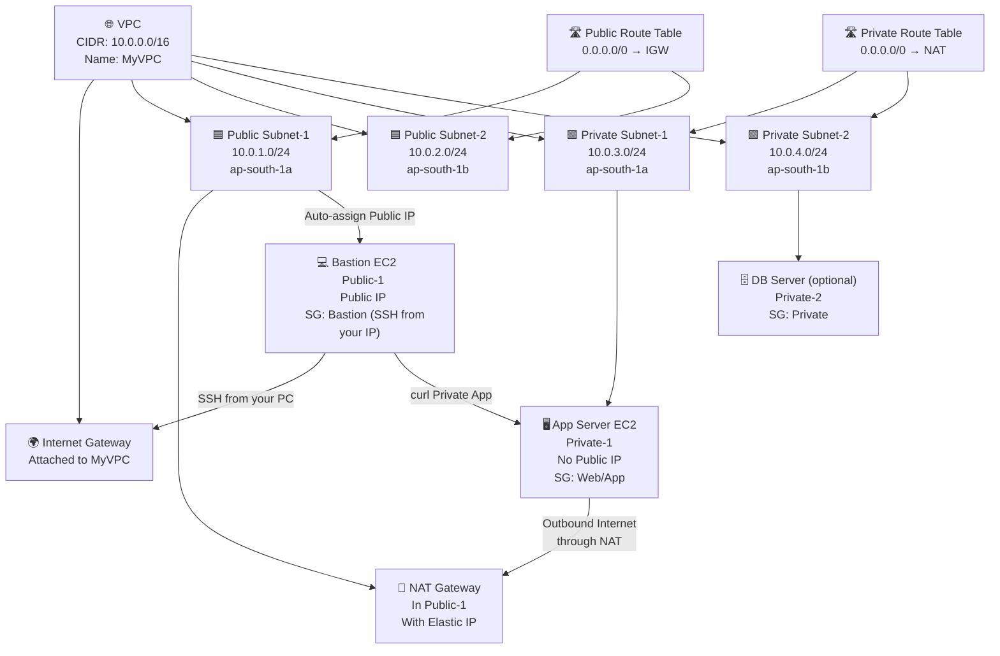

Here is a **clean, structured Mermaid flow diagram** for your **VPC + Subnets + Route Tables + NAT + EC2 topology** based exactly on your practical lab steps.

---

# **🔶 Mermaid Diagram — VPC Practical Topology**

---

# ✅ What This Diagram Shows

The diagram clearly shows:

### **✔ VPC structure**

– 4 subnets (2 public, 2 private)
– IGW, NAT Gateway

### **✔ Route table associations**

– Public RT → IGW
– Private RT → NAT

### **✔ EC2 placement**

– Bastion in Public-1
– App in Private-1
– DB in Private-2

### **✔ Traffic Flow**

– Your laptop → IGW → Bastion
– Private EC2 → NAT → Internet
– Bastion → Private EC2 (test using curl)

---

If you want, I can generate:

✅ A **Mermaid sequence diagram** (showing packet flow)
✅ A **Mermaid AWS architecture diagram (graph LR multi-layer format)**
✅ A **Markdown README lab guide**
✅ A **DOCX/PDF version**

Just tell me **YES**.
