Here is a **clean, structured Mermaid flow diagram** for your **VPC + Subnets + Route Tables + NAT + EC2 topology** based exactly on your practical lab steps.

---

# **🔶 Mermaid Diagram — VPC Practical Topology**

```mermaid
flowchart TD

    %% VPC
    VPC["🌐 VPC  
    CIDR: 10.0.0.0/16  
    Name: MyVPC"]

    %% IGW
    IGW["🌍 Internet Gateway  
    Attached to MyVPC"]

    %% NAT GW
    NAT["🔄 NAT Gateway  
    In Public-1  
    With Elastic IP"]

    %% Public Subnets
    P1["🟦 Public Subnet-1  
    10.0.1.0/24  
    ap-south-1a"]
    P2["🟦 Public Subnet-2  
    10.0.2.0/24  
    ap-south-1b"]

    %% Private Subnets
    PR1["🟩 Private Subnet-1  
    10.0.3.0/24  
    ap-south-1a"]
    PR2["🟩 Private Subnet-2  
    10.0.4.0/24  
    ap-south-1b"]

    %% Route Tables
    PRT["🛣️ Public Route Table  
    0.0.0.0/0 → IGW"]
    PRIVRT["🛣️ Private Route Table  
    0.0.0.0/0 → NAT"]

    %% EC2 Instances
    Bastion["💻 Bastion EC2  
    Public-1  
    Public IP  
    SG: Bastion (SSH from your IP)"]

    App["🖥️ App Server EC2  
    Private-1  
    No Public IP  
    SG: Web/App"]

    DB["🗄️ DB Server (optional)  
    Private-2  
    SG: Private"]

    %% Connections
    VPC --> IGW
    VPC --> P1
    VPC --> P2
    VPC --> PR1
    VPC --> PR2

    P1 --> NAT

    %% Route Table Associations
    PRT --> P1
    PRT --> P2

    PRIVRT --> PR1
    PRIVRT --> PR2

    %% Routing Paths
    P1 -- "Auto-assign Public IP" --> Bastion
    PR1 --> App
    PR2 --> DB

    Bastion -- "SSH from your PC" --> IGW

    App -- "Outbound Internet  
    through NAT" --> NAT

    Bastion -- "curl Private App" --> App

```

---

# ✅ What This Diagram Shows

The diagram clearly shows:

### **✔ VPC structure**

– 4 subnets (2 public, 2 private)
– IGW, NAT Gateway

### **✔ Route table associations**

– Public RT → IGW
– Private RT → NAT

### **✔ EC2 placement**

– Bastion in Public-1
– App in Private-1
– DB in Private-2

### **✔ Traffic Flow**

– Your laptop → IGW → Bastion
– Private EC2 → NAT → Internet
– Bastion → Private EC2 (test using curl)

---

If you want, I can generate:

✅ A **Mermaid sequence diagram** (showing packet flow)
✅ A **Mermaid AWS architecture diagram (graph LR multi-layer format)**
✅ A **Markdown README lab guide**
✅ A **DOCX/PDF version**

Just tell me **YES**.
